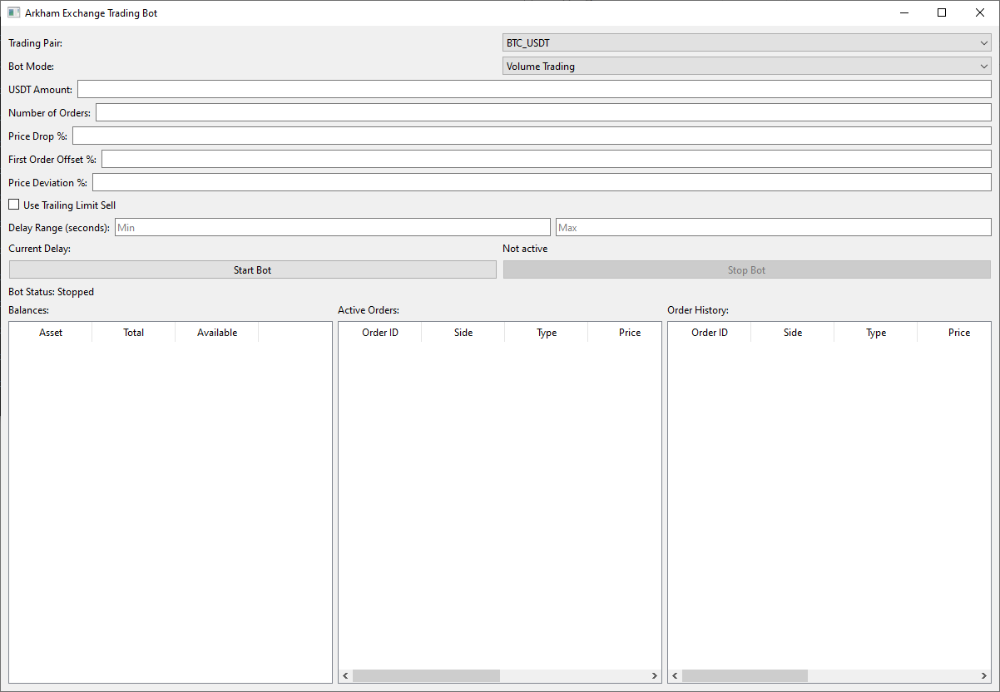

# Arkham Exchange Trading Bot



An automated trading bot for Arkham Exchange with a PyQt6 graphical interface. The bot supports two trading modes: Grid Trading and Volume Trading.

## Features

### Trading Modes:

1. **Grid Trading**
   - Places a grid of limit buy orders below the current price
   - Automatically averages positions when orders are filled
   - Places sell orders with specified profit percentage
   - Automatically restarts the grid after closing positions

2. **Volume Trading**
   - Places a single limit buy order
   - Sells at market price or using trailing limit
   - Random delays between operations
   - Continuously repeats the cycle

### Main Capabilities:

- **Graphical Interface**: User-friendly PyQt6 interface
- **Real-time Monitoring**: Track balances and active orders
- **Flexible Settings**: Configure all trading parameters
- **Automatic Risk Management**: Grid correction when price deviates
- **Detailed Logging**: Save all operations to log file

## Installation

### System Requirements:
- Python 3.12 or higher
- Operating System: Windows, macOS, Linux
- Microsoft Visual C++ Redistributable for Windows

### Install Dependencies:

```bash
pip install -r requirements.txt
```

### API Keys Configuration:

1. Open the file `config/api_config.py`
2. Add your Arkham Exchange API keys:

```python
# API Configuration
API_KEY = 'your_api_key_here'
API_SECRET = 'your_api_secret_here'
BASE_URL = 'https://arkm.com/api'
WS_URL = 'wss://arkm.com/ws'
```

### Run the Bot:

```bash
python main.py
```

## Parameter Configuration

### Basic Parameters:

- **Trading Pair**: Trading pair (e.g., BTC/USDT)
- **USDT Amount**: Amount in USDT for trading
- **Number of Orders**: Number of orders in the grid (Grid Trading only)
- **Price Drop %**: Price drop percentage for grid placement
- **First Order Offset %**: First order offset from current price
- **Target Profit %**: Target profit percentage
- **Price Deviation %**: Maximum price deviation for grid correction

### Volume Trading Parameters:

- **Min/Max Delay**: Random delay range between operations (in seconds)
  - Min Delay: Minimum wait time before next operation
  - Max Delay: Maximum wait time before next operation
  - The bot will randomly select a delay within this range for each cycle
- **Use Trailing Limit**: Enable trailing limit sell orders instead of market sells
  - When enabled, the bot places a limit sell order that follows the price upward
  - When disabled, the bot uses market sell orders for faster execution
- **Current Delay**: Displays the current countdown timer (read-only)

## Project Structure

```
├── api/                    # Arkham Exchange API integration
├── config/                 # Configuration files
├── gui/                    # Graphical interface
├── trading/                # Trading logic
│   ├── volume/            # Volume trading module
│   ├── grid_calculator.py # Grid level calculations
│   ├── position_manager.py # Position management
│   └── volume_trader.py   # Volume trading logic
├── utils/                  # Utilities and logging
├── main.py                # Main launch file
└── requirements.txt       # Dependencies
```

## Logging

All bot operations are recorded in the `trading_bot.log` file. Logs contain:
- Information about placed and filled orders
- Position and balance data
- Errors and exceptions
- Trading operation parameters

## Security

- **Never share your API keys**
- Use API keys with trading permissions only (no withdrawal rights)
- Regularly check bot activity and account balance
- Recommended to test on demo account before live trading

## Advanced Version

An advanced version of the bot is available with additional features:
- **Proxy server support** for bypassing regional restrictions
- **Profit and loss calculation** with detailed statistics

## Support

If you encounter installation difficulties or need the version with proxy support and profit/loss calculation, contact us on Telegram: https://t.me/iPartner_24
I wouldn't refuse a donation USDT (TON blockchain, without memo): UQACxM0kJfYbWI6RrugsWJ_HXj_CzjxM5N1z84Hf83VZI1Yy

## Disclaimer

This bot is for educational purposes only. Cryptocurrency trading carries high risks. The author is not responsible for any losses from using this software. Use the bot at your own risk.

## License

This project is provided "as is" without any warranties. Use at your own risk.
